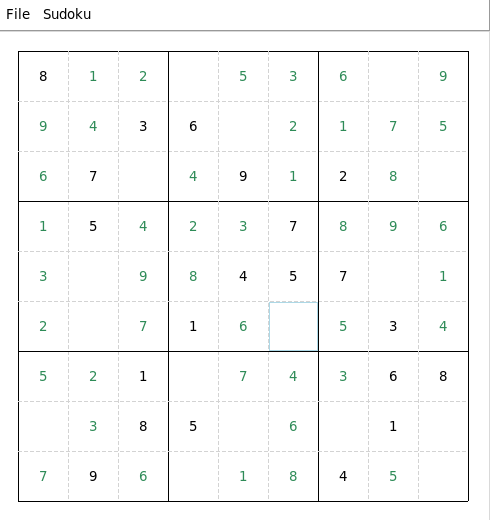

<h1 align="center">
  Sudoku
</h1>

# Table of Contents
- [Table of Contents](#table-of-contents)
- [About](#about)
  - [Usage](#usage)
  - [Solving](#solving)
  - [Generating](#generating)
- [Installation](#installation)
- [Contribution](#contribution)
- [TODO](#todo)
- [License](#license)

# About

  

> "Sudoku is a logic-based, combinatorial number-placement puzzle. The objective is to fill a 9×9 grid with digits so that each column, each row, and each of the nine 3×3 subgrids that compose the grid (also called "boxes", "blocks", or "regions") contain all of the digits from 1 to 9. The puzzle setter provides a partially completed grid, which for a well-posed puzzle has a single solution." (https://en.wikipedia.org/wiki/Sudoku, 2020.03.02 : 18:52)

## Usage

  

* Click on cell and enter a number between 0 and 9.
* When finished entering a Sudoku you may set the current grid as starting grid in the menu under `Sudoku/Set`.
* You may save or load a Sudoku by selecting `Save` or `Load` in the file menu.
  * The file to be loaded has to have a certain format:
    * The file has to be a textfile (*.txt).
    * The must not contain more than one line.
    * A empty cell equals a *"."* or *"0"*.
    * A filled cell is a number between 1 and 9
    * The end of a row is marked by **";"**.
    * Check the [examples folder](examples/) for examples.
* Clear all answers or all by selecting `Clear answers` or `Clear all` in the Sudoku menu.
  * Answer are cells that are not part of the starting grid.
* Generate a new Sudoku by selecting `Generate` in the Sudoku menu.

## Solving
The program aims to solve a given sudoku riddle by brute force and backtracking. There are currently two methods of solving:
1. *Naive backtracking*:
   1. Start at the top left cell and look for an empty cell.
   2. Try all numbers from 1 to 9 as solutions for that cell, fill in the first valid number and go to 1. with the updated grid (*recursion*).
   3. Repeat 1. and 2. until...
      * ... there are no empty cells left. Safe the current grid as solution.
      * ... there is no valid solution for a cell. In that case backtrack, mark the current cell as empty again and go to 1.
2. *Dynamic Backtracking*:
   1. Find a cell with the minimum amount of possible solutions. (There is no fixed order unlike with *Naive backtracking*)
   2. Fill in one of the possible solutions and go to 1. with the updated grid.
   3. Repeat 1. and 2. until...
      * ... there are no empty cells left. Safe the current grid as solution.
      * ... There is no solution for a cell in which case backtrack, mark current cell as empty again and go to 2.

So far both algorithms have proven to be somewhat fast for Sudokus with ~26 given cells however the second algorithm holds up much better for less given cells and can solve riddles which the first one cannot within a reasonable timeframe.

## Generating
Generating a Sudoku requires two steps (at least my approach). First generate a random fully solved Sudoku and secondly set randomly chosen cells to empty while making sure the Sudoku only has one unique solution (which can be checked with one of the solving algorithms).

Since this a backtracking approach and therefor has to validate the sudoku at every recursive call, generating Sudokus takes time increasing with the amount of empty cells.

# Installation
1. Clone this repository with `git clone https://github.com/Xcal1bur/Sudoku.git`.
2. Navigate to the repository's root directory and run `pip install -U .` to install it at *~/.local/lib/python3.7/site-packages*.
3. Now you can start the application by running `sudoku` in your terminal.

# Contribution
Please feel free to report bugs or request features by opening an issue.

# TODO
* [X] Generating Sudokus. 
* [X] Implement different methods of solving.
  * [X] Improve current algorithm.
* [X] **Write tests**.
* [ ] ~~Implement as terminal app with argparse~~
* [X] Implement GUI for solving and generating
* [ ] (Implement different versions of Sudoku like ["Alphabetical Sudoku"](https://en.wikipedia.org/wiki/Sudoku#Alphabetical_Sudoku).)
* [X] Implement method to conveniently enter new riddles.

# License
Copyright (C) 2020 David Voigt

This program is free software: you can redistribute it and/or modify
it under the terms of the GNU General Public License as published by
the Free Software Foundation, either version 3 of the License, or
(at your option) any later version.

This program is distributed in the hope that it will be useful,
but WITHOUT ANY WARRANTY; without even the implied warranty of
MERCHANTABILITY or FITNESS FOR A PARTICULAR PURPOSE.  See the
GNU General Public License for more details.

You should have received a copy of the GNU General Public License
along with this program.  If not, see https://www.gnu.org/licenses/.
